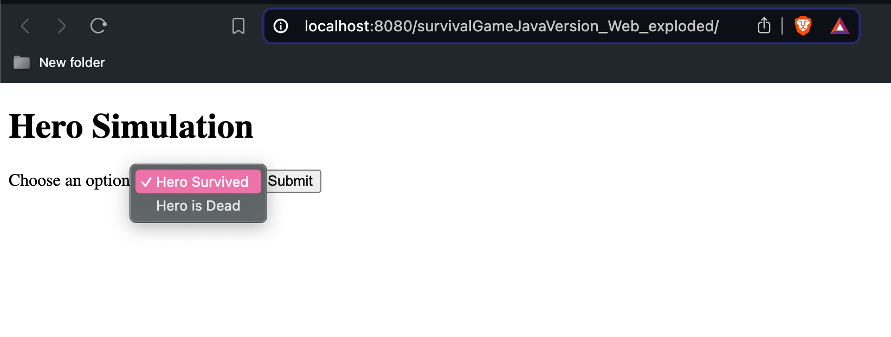
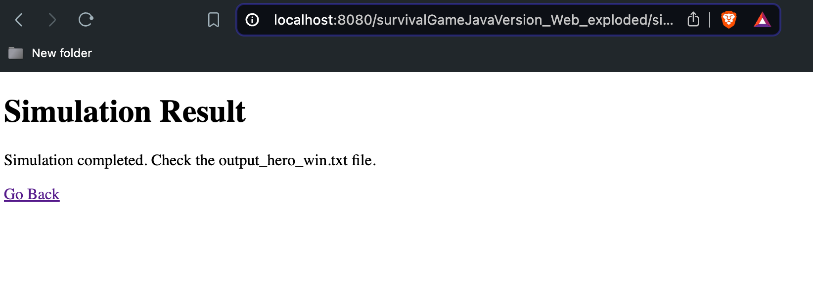
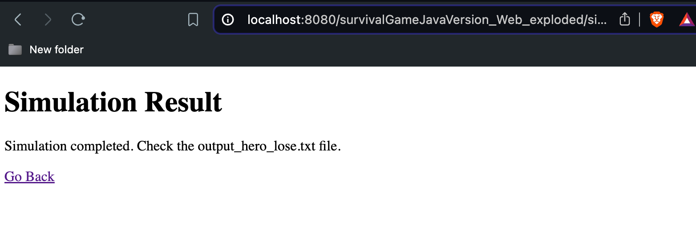

# SURVIVAL GAME JAVA VERSION

This project include following requirements

In the 23rd century the war between two empires led to a nuclear apocalypse which led to extinction of nearly all civilization and animal life. As we are the only survivors we are trying to build a new civilization but resources required to sustain life are rare. The radioactivity makes outdoors dangerous. We are living in an old bunker that is left from WW2. Volunteers need to get out to the dangerous lands and get to the places where they can get resources. Luckily the bunker we are living has an old radar that can find creatures on our path to the resources. As a surviving engineer you are required to write a simulation that can simulate if a volunteer can reach to resources. Be aware that our radar indicates that there are dangerous creatures and even zombies on the wasteland.
Write a simulation that find outs if the hero would survive or not. You can use the following sample input and output as a reference. If the volunteer hero faces an enemy he needs to fight against it until one of them dies. To simulate fights you can accept that enemy and the hero attack at the same time. hp represents health points. Each attack decreases health points equal to attack. To avoid radioactivity volunteer hero wears a special heavy armor that makes him walk meter by meter.

## Tech Stack

**Server:** Java, JSP

## Folder Structure

```bash
survivalGameJavaVersion/
├── web/ # webapp files
│   ├── WEB-INF
│   ├──├──config.properties # env params
│   ├──├──input_hero_lose.txt # hero lose input version
│   ├──├──input_hero_win.txt # hero win input version
│   ├──├──output_hero_lose.txt # hero lose output version
│   ├──├──output_hero_win.txt # hero win output version
│   ├── index.jsp
│   ├── result.jsp
├── src/ #Source files
│   ├── main
│   ├── ├── resources # input and output files for write/read process
│   ├──├──├──config.properties # env params
│   ├──├──├──input_hero_lose.txt # hero lose input version
│   ├──├──├──input_hero_win.txt # hero win input version
│   ├──├──├──output_hero_lose.txt # hero lose output version
│   ├──├──├──output_hero_win.txt # hero win output version
│   ├── ├── java
│   ├──├──├──com.berce
│   ├──├──├──├── model
│   ├──├──├──├──├──Character # enemy & hero char properties abstract class
│   ├──├──├──├──├── Enemy # Enemy class
│   ├──├──├──├──├── Hero # Hero class,
│   ├──├──├──├──├── Resource # Resource class
│   ├──├──├──├──├── Choice # Input choice enum. 1 or 2?
│   ├──├──├──├── service
│   ├──├──├──├──├── Simulation # Simulation for desired output
│   ├──├──├──├── utils
│   ├──├──├──├──├── handler
│   ├──├──├──├──├──├──  FileReaderHandler # Input read handler
│   ├──├──├──├──├──├──  FileWriterHandler # Output write handler
│   ├──├──├──├──├──  parser
│   ├──├──├──├──├──├──  InputParser # Includes input parser for desired input schema
│   ├──├──├──├──├──  validator
│   ├──├──├──├──├──├──  InputValidator # Includes input validations for desired input schema
│   ├──├──├──├── Main #start and listen the project
│   ├── test
├── README.md
```

## Run Locally

Clone the project

```bash
  git clone https://github.com/bouygun/survivalGameJavaVersion.git
```

Go to the project directory

Run from com.berce.Main Class
or
Run with Tomcat from 8080 port

## Running Tests

> ## **it's not over yet** 
tests are missing, will be completed

## Demo
First page. You should choose an option. 

If you want hero survived:

Or hero dead:
